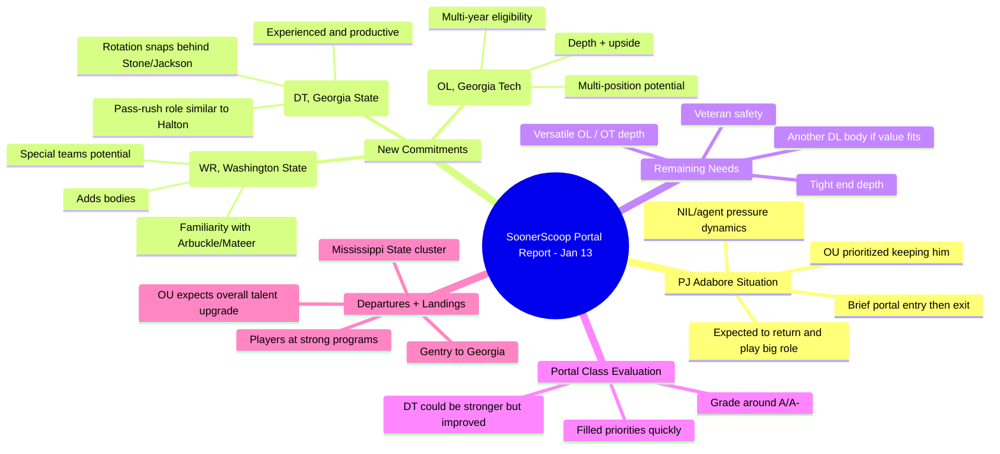

> [!summary]- Description
> A little bit of drama over the weekend as Adepoju Adebawore went into the portal but really didn't go into the portal? But is back with the Sooners? But is there a contract that is signed? George Stoia has all the latest with the talented but not yet dominant Adebawore. The Sooners pick up an offensive tackle, a defensive lineman and a wide receiver since we last talked. We'll tell you what is what on the latest. And we take a look at where the now former Sooners are landing. Gentry Williams to Georgia? How many former players are landing on teams the Sooners will have to play in 2026?

> [!transcript]- Transcript (YouTube)

Title: **Oklahoma Transfer Portal Update (Jan 13) — PJ Adabore Scare + 3 New Commitments + What’s Next**

Brief:  
This episode of the _SoonerScoop “Portal Report”_ breaks down Oklahoma’s latest transfer portal movement as of **Tuesday, January 13**. The hosts cover the brief panic around **PJ Adabore** momentarily entering the portal (then immediately exiting), explain why Oklahoma fought hard to keep him, and review three new portal commitments—**Payton Joseph (OL), Mackenzie Allen (WR), and Bishop Thomas (DT)**. They also assess how OU has done overall in the portal, what roster spots still need attention, and where departing Sooners are landing across the country.

---

## Things to take away from the video

### 1) PJ Adabore portal “scare” ended in good news

- 🟢 PJ briefly appeared in the portal and was out **within minutes**, which the hosts call very unusual.
    
- 🟢 Oklahoma’s staff pushed hard to keep him, and the expectation is he returns and plays a bigger role in 2026.
    

### 2) NIL/representation dynamics are driving portal behavior

- 💰 The hosts suggest outside voices (agents/representation and/or other programs) may push players to “test the market.”
    
- 💰 OU responded with a **strong revised offer** because replacing a starter-level edge player would be expensive.
    

### 3) Why keeping PJ matters so much

- 🧱 PJ’s late-season growth made him a potential **starter or major snap** player next year.
    
- 🧱 The hosts believe losing him would’ve been OU’s **biggest portal loss** of this cycle.
    

### 4) Commitment #1 — Payton Joseph (Georgia Tech OL) = future depth with upside

- 🧩 He’s a **6’4”, 305 lb** young lineman with limited snaps so far, but high recruiting pedigree.
    
- 🧩 OU needs bodies after taking a small HS OL class; he’s viewed as a developmental piece with multi-year eligibility.
    

### 5) Commitment #2 — Mackenzie Allen (Washington State WR) adds bodies + system familiarity

- 🧠 OU has lost multiple young receivers, so adding numbers matters.
    
- 🧠 Allen knows the **Arbuckle/John Mateer** ecosystem and may contribute on **special teams** while developing.
    

### 6) Commitment #3 — Bishop Thomas (Georgia State DT) is a real rotation piece

- 🧱 He has real production and experience (FSU → Colorado → Georgia State → OU).
    
- 🧱 The hosts expect him to play **meaningful snaps** as the DT #3/#4 in rotation behind **David Stone and Jayden Jackson**.
    

### 7) Defensive staff trust factor

- 🛠️ The hosts argue OU’s defensive coaches (Venables/Bates/Chavis) have a track record of developing depth into contributors.
    
- 🛠️ Even if the depth looks thin on paper, they wouldn’t be shocked if players like **Nigel Smith** or **Trent Wilson** “pop.”
    

### 8) What OU might still add before the portal window closes

- 🧷 Possible targets: **veteran safety**, another **OT/versatile OL**, a **tight end**, and maybe another **DL body** if affordable.
    
- 🧷 They do **not** expect OU to chase the mega-expensive “top of portal” players.
    

### 9) Portal class overall: OU is meeting needs quickly and effectively

- 🏁 They’d grade the portal work around **A / A-** (maybe B+ at worst), saying OU filled most priorities.
    
- 🏁 Biggest miss would’ve been landing a top DT target, but Bishop Thomas still helps stabilize the interior rotation.
    

### 10) Departures: OU players are landing at strong programs

- 🧳 Several transfers landed in good places (notably **Gentry Williams → Georgia**, multiple to **Mississippi State**, others to UCLA/Old Miss/Cincinnati, etc.).
    
- 🧳 Their takeaway: OU had real talent, and OU also believes it’s **upgrading** through additions.
    

---

## Mindmap (Mermaid)

---

## Summary

Oklahoma’s portal week featured both drama and progress. The biggest storyline was **PJ Adabore** briefly entering the portal and then immediately exiting—something the hosts call rare. They believe OU’s staff and front office worked hard behind the scenes, likely via a stronger NIL/contract offer, because PJ’s late-season improvement made him too valuable to lose.

On the recruiting side, OU added three portal commitments aimed at **depth now and development later**—with one immediate rotational contributor. **Payton Joseph** is a high-upside, multi-year offensive lineman who likely won’t be needed right away but helps replenish bodies. **Mackenzie Allen** is a younger receiver familiar with the offensive ecosystem and a potential special-teams contributor while OU rebuilds WR depth. **Bishop Thomas** is the most “ready now” addition: an experienced defensive tackle expected to take meaningful rotational snaps, helping keep OU’s defensive front fresh.

Overall, the hosts feel Oklahoma has **hit its portal priorities** efficiently, projecting an **A/A- level** outcome so far. Looking ahead, they expect OU may still pursue value adds at **safety, tight end, OL tackle depth, and possibly another DL**, but not the ultra-expensive top-of-market stars.

---

## Notable Quotes (timestamp: transcript)

- 00:00: “Oklahoma fans have a little bit of a scare… when he entered the portal… then he left the portal.”
    
- 00:00: “Oklahoma… did not want to lose him.”
    
- 00:00: “I don’t know why he showed up in the portal on Monday and then was out… 2 minutes later.”
    
- 00:00: “At the end of the day… you got a guy back that is likely going to either start for you or play a lot of meaningful snaps next season.”
    
- 00:00: “If Payton Joseph’s on the field, either he’s amazing or something has gone horribly wrong for Oklahoma.”
    
- 00:00: “Bishop Thomas… is somebody Oklahoma views as their third or fourth guy in that rotation.”
    
- 00:00: “I just kind of trust this defensive coaching staff…”
    
- 00:00: “If you asked me for a grade, I’d probably give them around an A, A-minus…”
    

> Note: Your transcript didn’t include actual timestamps, so I used “00:00” placeholders. If you paste the timestamped transcript (or enable “Show transcript” with timestamps), I’ll regenerate this section with accurate time links.

