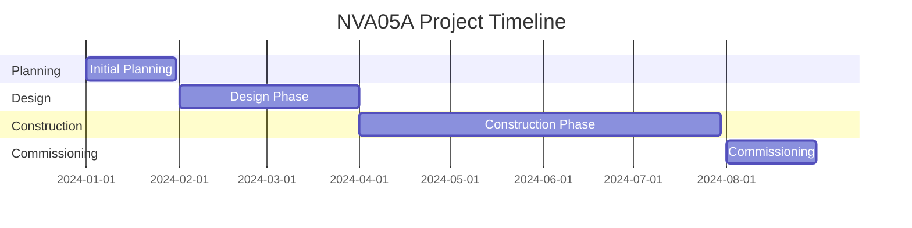

# NVA05A Project

## Project Overview
Data center project - NVA05A site

## Key Information
- **Project Code:** NVA05A
- **Status:** In Progress
- **Location:** [Site location]
- **Client:** [Client name]

## Quick Access Links
- [[1770241714443_06_07_24_Activity|Quick Links & Resources]]
- [NVA05A OneDrive Folder](https://stackinfrastructure-my.sharepoint.com/:f:/g/personal/dnuckolls_stackinfra_com/ErhZ2t3AmQtLilUrEZd_XkoBzvpqAWOCnndnYKiUIS42pA?e=52sqoT)
- [D2D Checklist Open Items](https://stackinfrastructure.sharepoint.com/)

## Project Documents
### Safety & EHS
- [[1770241714443_RE_NVA05A_Emergency_Evacuation_Maps|Emergency Evacuation Maps]]
- Site Safety Folders

### Checklists
- [[D2D Checklist]]
- [[1770241714443_06_07_24_Activity|D2D Checklist - EHS Tab]]

## Meetings
### Cancelled/Past
- [[1770241714441_CANCELLED-D2D_Safety-Ops_Sync_Up_-_7-19-2024|D2D Safety/Ops Sync (Cancelled 7/19/24)]]

### Upcoming
- 

## Team Members
### Internal Team
- David Nuckolls (dnuckolls@stackinfra.com)
- Anthony Antonellis (aantonellis@stackinfra.com) - Assistant Critical Operations Manager
- Andrew Van Kleeck (avankleeck@stackinfra.com)
- Eric Hinson (ehinson@stackinfra.com)
- Rebecca Boyer (rboyer@stackinfra.com)
- Carmen Pacheco (cpacheco@stackinfra.com)
- Kate Crawford (kcrawford@stackinfra.com)
- Hocine Mbolidi (hmbolidi@stackinfra.com)

### External Contacts
- 

## Current Action Items
- [ ] Complete D2D Checklist items
- [ ] Review and approve Emergency Evacuation Maps
- [ ] Post evacuation maps throughout facility
- [x] 

## Project Phases
### Phase 1: Planning
- [x] 

### Phase 2: Design
- [x] 

### Phase 3: Construction
- [x] 

### Phase 4: Commissioning
- [x] 

### Phase 5: Handover
- [x] 

## Safety Items
### Completed
- [x] Emergency Evacuation Maps created
- [x] Site Safety Folders updated

### In Progress
- [ ] Emergency Evacuation Maps approval
- [ ] Emergency Evacuation Maps posting

### Planned
- [x] 

## Key Milestones
| Date | Milestone | Status |
|------|-----------|--------|
|      |           |        |

## Issues & Risks
### Open Issues
- 

### Resolved Issues
- 

### Risks
- 

## Notes
- 

## Files & Attachments
- NVA05A-Emergency Evacuation Plan 1.pdf
- D2D - EHS Tab.pdf

## Related Projects
- 

---

## Project Timeline

---

*Last Updated: [Date]*
